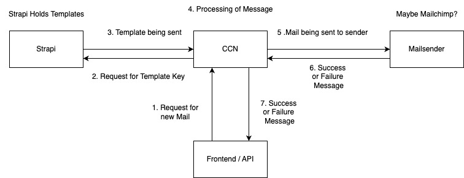

# Close Circle Newsletter

### Base Info
Language: Java\
Version:  21\
Frameworks: Spring

### Intro
This is a free time project of mine, with the intention of extending my Java 
skill set. I wanted to create a newsletter, that is intended to be read by my
close circle (hence the name). I will utilize the GraphQL endpoint
of my self-hosted Strapi CMS, to retrieve templates. I will also make use of
a MySQL DB to retrieve recipients and probably use a third party service to 
send the mails.

With this project I will also focus on test driven development and rely on
integration testing to extend the functionality of this project. My 
CI definition will try to reflect that, and take work of my back.

### Todo List

- [x] Add definition for Mail, MailRecipient and MailSendingMutation to GraphQL
- [x] Create basic working Integration Testing setup
- [ ] Create tests for MailSendingMutation
- [ ] Create test for NewsletterSignUpMutation
- [ ] Connect to Strapi and retrieve Mail Templates (Authenticated Endpoint)
- [ ] Correctly parse templates (Name values etc)
- [ ] Enable access to DB and retrieve users (Maybe create service for that?)
- [ ] Connect to MailSending Api or create own base for sending mails
- [ ] Send (Test) Mails
- [ ] Create Docker Definition 
- [ ] Create GitHub CI Definition
- [ ] Deploy to server
- [ ] Final tests

### Installing the project

Use `mvn clean install` to install the project.

### Commands for running the project locally

- Running the integration tests locally: `mvn integration-test`
- Starting the project locally: `mvn spring-boot:run`